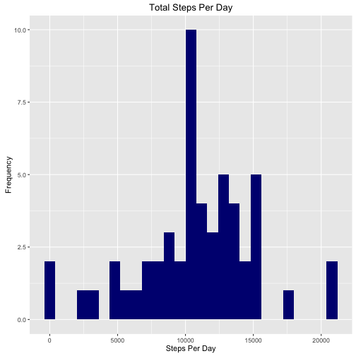
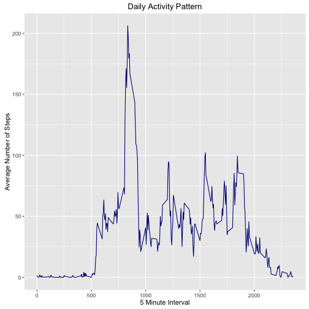
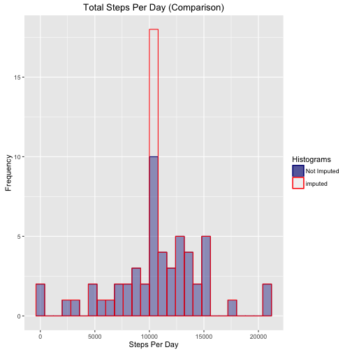
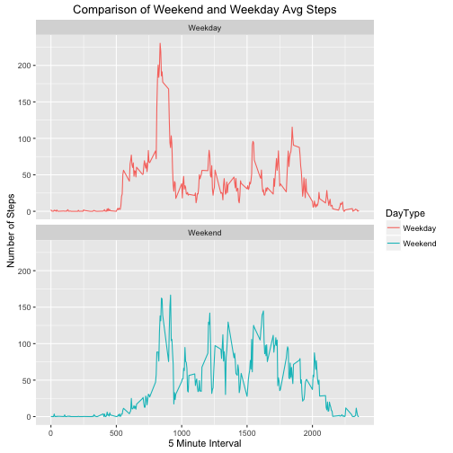

# Reproducible Reasearch: Peer Assignment 1

###### ncosentino100


##Introduction
This assignment makes use of data from a personal activity monitoring device. This device collects data at 5 minute intervals throughout the day. The data consists of two months of data from an anonymous individual collected during the months of October and November, 2012 and include the number of steps taken in 5 minute intervals each day.

The code outlined below allows the user to:

1. Load in the data 

2. Process/transform it into a format suitable for analysis

3. Graphically showcase the total number of steps taken on each day (excluding missing           values)

4. Calculate and report the mean and median number of steps taken on each day                    (excluding missing values)

5. Graphically showcase the average number of steps taken over each 5 minute interval

6. Calculate the 5 minute interval (across all days) that contains the greatest number of steps

7. Calculate the total number of missing values in the original dataset

8. Create a new dataset containing imputed values for those missing in the original

9. Graphically showcase the total number of steps taken each day (with imputed values)

10. Calculate and report the mean and median number of steps taken on each day (with              imputed values)

11. Compare the calculated total, mean, and median steps taken each day in orginal                dataset with those of the imputed dataset

12. Create a new factor variable within the imputed dataset that designates each                  observation as Weekday or Weekend (corresponding to the date)

13. Graphically showcase a comparison of the average number of steps taken on Weekdays            with those taken on Weekends.


## Setting the Environment and Loading Libraries 

### Setting the Environment

```r
knitr::opts_chunk$set(echo = TRUE, cache = TRUE, warning = FALSE, results = TRUE)
options(digits = 2, scipen = 999)
```

### Loading Libraries

```r
library(knitr)
library(ggplot2)
library(dplyr)
```

```
## 
## Attaching package: 'dplyr'
```

```
## The following objects are masked from 'package:stats':
## 
##     filter, lag
```

```
## The following objects are masked from 'package:base':
## 
##     intersect, setdiff, setequal, union
```

```r
library(lubridate)
```

```
## 
## Attaching package: 'lubridate'
```

```
## The following object is masked from 'package:base':
## 
##     date
```


## Loading and Preprocessing the Data

### Loading the Data

```r
if(!file.exists("activity.csv")){
        unzip("activity.zip")
}

rawactivityData <- read.csv("activity.csv", header = TRUE, stringsAsFactors = FALSE)
```

### Preprocessing the Data

#### Looking at Structure of Data

```r
str(rawactivityData)
```

```
## 'data.frame':	17568 obs. of  3 variables:
##  $ steps   : int  NA NA NA NA NA NA NA NA NA NA ...
##  $ date    : chr  "2012-10-01" "2012-10-01" "2012-10-01" "2012-10-01" ...
##  $ interval: int  0 5 10 15 20 25 30 35 40 45 ...
```

```r
head(rawactivityData)
```

```
##   steps       date interval
## 1    NA 2012-10-01        0
## 2    NA 2012-10-01        5
## 3    NA 2012-10-01       10
## 4    NA 2012-10-01       15
## 5    NA 2012-10-01       20
## 6    NA 2012-10-01       25
```

#### Formatting Dates Correctly

```r
actData <- rawactivityData
actData$date <- ymd(actData$date)

str(actData)
```

```
## 'data.frame':	17568 obs. of  3 variables:
##  $ steps   : int  NA NA NA NA NA NA NA NA NA NA ...
##  $ date    : Date, format: "2012-10-01" "2012-10-01" ...
##  $ interval: int  0 5 10 15 20 25 30 35 40 45 ...
```


## What is the Mean Total Number of Steps Taken Per Day?

### Histogram of the Total Number of Steps Taken Each Day (Excluding NAs)

```r
stepsPerDay <- actData %>% 
        filter(!is.na(steps)) %>%
        group_by(date) %>%
        summarize(steps = sum(steps))

ggplot(stepsPerDay, aes(x = steps)) +
        geom_histogram(fill = "navy", binwidth = 800) +
        labs(title = "Total Steps Per Day", x = "Steps Per Day", y = "Frequency")
```



### Mean and Median Total Number of Steps Taken Per Day (Excluding NAs)

```r
stepsMean <- mean(stepsPerDay$steps, na.rm = TRUE)
stepsMedian <- median(stepsPerDay$steps, na.rm = TRUE)
```

The mean total number of steps taken per day is equal to 10766.19, while the median number of steps take per day is equal to 10765.


## What is the Average Daily Activity Pattern? (Excluding NAs)

### Time Series Plot 

```r
actDailyInt <- actData %>%
        filter(!is.na(steps)) %>%
        group_by(interval) %>%
        summarize(steps = mean(steps))

ggplot(actDailyInt, aes(x = interval, y = steps)) +
        geom_line(color = "navy") +
        labs (title = "Daily Activity Pattern", x = "5 Minute Interval", y = "Average Number of Steps")
```



### Interval With Maximum Number of Steps Across All Days

```r
MaxAvg <- max(actDailyInt$steps)
Interval_MaxAvg <- actDailyInt$interval[actDailyInt$steps == MaxAvg]
```

The max average number of steps occurs at interval 835 and is equal to 206.17.


## Imputing Missing Values

### Total Number of Missing Values (coded as NA)

```r
MissingValues <- sum(is.na(actData))
```

The total number of missing values is equal to 2304.

### New Dataset Including Imputed Values for NAs

```r
actData2 <- actData
actData2NA <- is.na(actData2$steps)
MeanInterval <- tapply(actData2$steps, actData2$interval, mean, na.rm = TRUE, simplify = TRUE)
actData2$steps[actData2NA] <- MeanInterval[as.character(actData2$interval[actData2NA])]

NewMissingValues <- sum(is.na(actData2$steps))
```

After imputing the average number of steps per 5 minute interval the number of missing values equals 0.

### Histogram Of Imputed Dataset and Comparison to Original Histogram

```r
stepsPerDay2 <- actData2 %>%
        group_by(date) %>%
        summarize(steps = sum(steps))

ggplot() +
        geom_histogram(aes(x = steps, fill = "n", colour = "n"), alpha = .4, 
                       data = stepsPerDay, binwidth = 800) +
        geom_histogram(aes(x = steps, fill = "r", colour = "r"), alpha = .4, 
                        data = stepsPerDay2, binwidth = 800) +
        scale_colour_manual(name = "Histograms", values = c("n" = "navy", "r" = "red"),
                        labels = c("n" = "Not Imputed", "r" = "imputed")) +
        scale_fill_manual(name = "Histograms", values = c("n" = "navy", "g" = "red"), 
                        labels = c("n" = "Not Imputed", "r" = "imputed")) +
        labs(title = "Total Steps Per Day (Comparison)", x = "Steps Per Day", y = "Frequency")
```



### Imputed Data Mean and Median Total Number of Steps Taken Per Day

```r
stepsMeanI <- mean(stepsPerDay2$steps)
stepsMedianI <- median(stepsPerDay2$steps)
```

The mean total number of steps taken per day for the imputed data equals 10766.19; the median total number of steps taken per day for the imputed data also equals 10766.19.

### Differences between the Non-Imputed and Imputed Data

```r
meandiff <- mean(stepsPerDay2$steps)-mean(stepsPerDay$steps)
mediandiff <- median(stepsPerDay2$steps)-median(stepsPerDay$steps)
totaldiff <- sum(stepsPerDay2$steps)-sum(stepsPerDay$steps)
```

Given the inclusion of imputed values the difference in mean total number of steps per day is 0, the difference in median total number of steps per day is 1.19, and the difference in the total number of steps is 86129.51.

## Are there Difference in Activity Patterns Between Weekdays and Weekends?

### Creating Day Classification Factor Variable

```r
actData2$DayType <- weekdays(actData2$date)
actData2$DayType <- ifelse(actData2$DayType == "Saturday"| actData2$DayType == "Sunday", "Weekend", "Weekday")
str(actData2)
```

```
## 'data.frame':	17568 obs. of  4 variables:
##  $ steps   : num  1.717 0.3396 0.1321 0.1509 0.0755 ...
##  $ date    : Date, format: "2012-10-01" "2012-10-01" ...
##  $ interval: int  0 5 10 15 20 25 30 35 40 45 ...
##  $ DayType : chr  "Weekday" "Weekday" "Weekday" "Weekday" ...
```

### Time Series Panel Plot Comparing Weekdays and Weekends 

```r
WeekData <- actData2 %>%
        group_by(interval, DayType) %>%
        summarize(steps = mean(steps))

g <- ggplot(WeekData, aes(x = interval, y = steps, color = DayType)) +
        geom_line() +
        facet_wrap(~DayType, ncol = 1, nrow = 2) +
        labs(title = "Comparison of Weekend and Weekday Avg Steps", x = "5 Minute Interval", y = "Number of Steps")
print(g)
```


